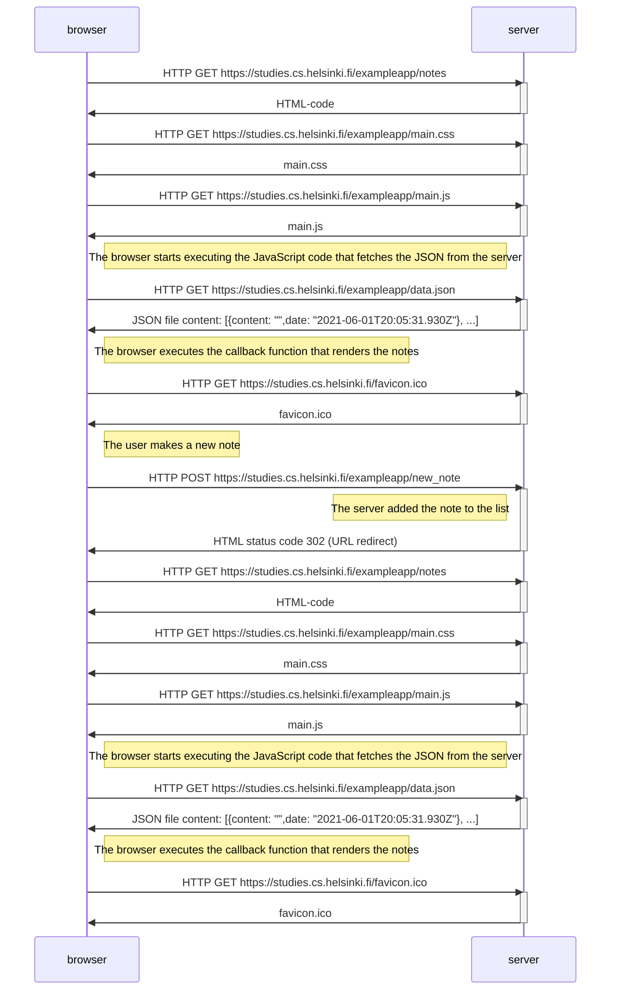

```markdown
sequenceDiagram
participant browser
participant server

browser->>server: HTTP GET https://studies.cs.helsinki.fi/exampleapp/notes
activate server
server->>browser: HTML-code
deactivate server
browser->>server: HTTP GET https://studies.cs.helsinki.fi/exampleapp/main.css
activate server
server->>browser: main.css
deactivate server
browser->>server: HTTP GET https://studies.cs.helsinki.fi/exampleapp/main.js
activate server
server->>browser: main.js
deactivate server

note right of browser: The browser starts executing the JavaScript code that fetches the JSON from the server

browser->>server: HTTP GET https://studies.cs.helsinki.fi/exampleapp/data.json
activate server
server->>browser: JSON file content: [{content: "",date: "2021-06-01T20:05:31.930Z"}, ...]
deactivate server

note right of browser: The browser executes the callback function that renders the notes

browser->>server: HTTP GET https://studies.cs.helsinki.fi/favicon.ico
activate server
server->>browser: favicon.ico
deactivate server

note right of browser: The user makes a new note

browser->>server: HTTP POST https://studies.cs.helsinki.fi/exampleapp/new_note
activate server

note left of server: The server added the note to the list

server->>browser: HTML status code 302 (URL redirect)
deactivate server

browser->>server: HTTP GET https://studies.cs.helsinki.fi/exampleapp/notes
activate server
server->>browser: HTML-code
deactivate server
browser->>server: HTTP GET https://studies.cs.helsinki.fi/exampleapp/main.css
activate server
server->>browser: main.css
deactivate server
browser->>server: HTTP GET https://studies.cs.helsinki.fi/exampleapp/main.js
activate server
server->>browser: main.js
deactivate server

note right of browser: The browser starts executing the JavaScript code that fetches the JSON from the server

browser->>server: HTTP GET https://studies.cs.helsinki.fi/exampleapp/data.json
activate server
server->>browser: JSON file content: [{content: "",date: "2021-06-01T20:05:31.930Z"}, ...]
deactivate server

note right of browser: The browser executes the callback function that renders the notes

browser->>server: HTTP GET https://studies.cs.helsinki.fi/favicon.ico
activate server
server->>browser: favicon.ico
deactivate server
```
